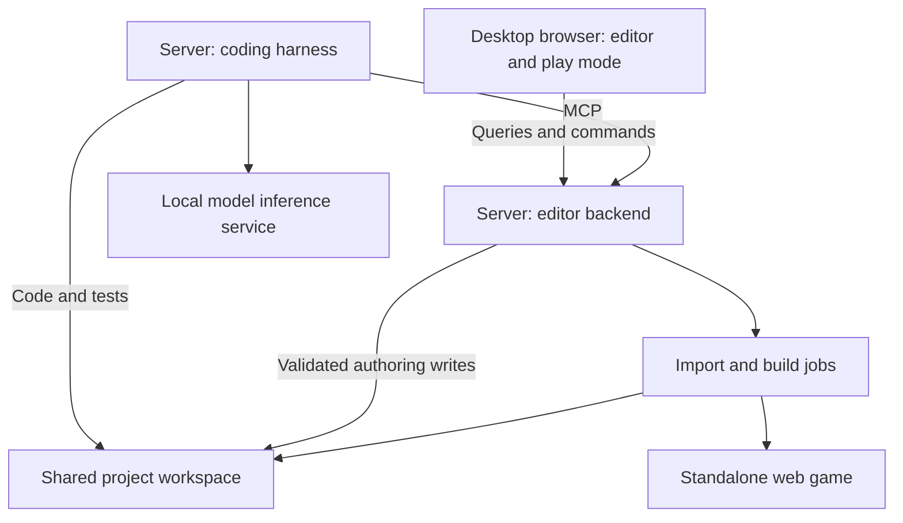

# Three.js Game Editor — Charter and Architecture

Version: 0.1 · 2026-09-16 · Planning draft; no implementation started.

## 1. Purpose

Build a personal, self-hostable, browser-based game editor using three.js. Human visual editing and external AI tools must operate on the same project through well-defined interfaces. Keep implementation tasks small enough for local models to understand, implement, and verify independently.

The long-term ambition includes scene authoring, prefabs, gameplay systems, UI, material and shader graphs, asset previews, efficient rendering, and genre templates. The initial proving ground is one short side-scrolling 2.5D platformer. Future RPG support should be possible without building RPG features into the foundation now.

## 2. Decisions and status

| Decision | Status |
|---|---|
| Export targets the web, not exclusively WebGL | Confirmed |
| First game is a side-scrolling 2.5D platformer | Confirmed |
| Desktop editor; desktop gameplay with keyboard and controller first | Confirmed |
| Personal self-hosting; others may clone the repository and host their own instances | Confirmed |
| Browser authoring may use a transparent backend | Confirmed |
| Backend owns project files and runs on the same server as the coding harness | Confirmed |
| Backend and harness access the same underlying workspace | Confirmed |
| TypeScript editor/runtime; targeted WebAssembly modules when justified | Recommended default; not explicitly confirmed |
| External coding harness plus MCP before embedded chat | Recommended default |
| WebGPU enhancements with a supported WebGL 2 baseline | Recommended compatibility policy; prove feature coverage before promising parity |
| One active authoring session per project initially | Proposed scope limit |

Hosting is an implementation detail for the user: opening the editor should not require manually orchestrating services each session. Initial setup may require a documented container deployment.

## 3. Product boundaries

### First useful release

- Scene hierarchy, inspector, transform tools, snapping, undo/redo.
- Stable project persistence, recovery, validation, and versioned data formats.
- Explicit component properties and isolated play mode.
- Basic reusable prefabs; advanced nesting/variants added only after semantics are specified.
- GLB/glTF-oriented initial asset workflow with model/material/animation previews and stable asset identities.
- Platformer movement, collisions, keyboard/controller actions, camera, simple animation, audio, and HUD.
- Material presets, lights/shadows, and conservative rendering defaults.
- Diagnostics and AI access to project queries, edits, errors, and connected play sessions.
- Standalone web export independent of the editor server.

### Deferred features

Full shader graph authoring, probe-volume baking, dynamic GI, advanced occlusion, automatic LOD generation, terrain, complex particles, cinematic tools, multiplayer, collaborative editing, embedded agents, mobile acceptance, and RPG systems.

These are deferred, not prohibited. Their future requirements must not justify speculative frameworks in the first milestone.

### Genre templates

A template declares required modules, starter content, presets, and editor layouts. Panel visibility and runtime module inclusion are separate settings. Existing content cannot silently lose behavior when a panel is hidden. Builds derive required modules from declared dependencies and referenced content; unresolved dependencies fail validation.

## 4. Deployment and ownership

The browser performs interactive rendering on the client GPU. The server owns files, authoring transactions, job coordination, and session routing. Inference can run on another machine without moving the working copy.

Separate backend and harness containers mount the same host workspace. Paths inside containers need not match. APIs use project IDs and project-relative paths, never assume another container's absolute path.

The editor engine repository and game project repositories are conceptually separate. A sample project can live in the engine monorepo initially. Independent games pin an engine version and dependency lockfile.

Source scenes, prefab definitions, scripts, project settings, asset metadata, and original assets are authoritative. Import caches, thumbnails, bundles, and other derived outputs are reproducible. Browser caches are disposable. Git tracks suitable project sources; a documented large-asset and backup policy remains necessary. Git history does not replace backups of untracked assets.

## 5. Module architecture

Names below indicate logical boundaries, not a requirement to create every package immediately.

| Module | Owns | Allowed dependencies / restrictions |
|---|---|---|
| Project model | IDs, serializable schemas, references, validation, migrations | Pure data/logic; no UI, filesystem, or three.js objects |
| Command core | Transaction validation, change sets, inverse changes, revision checks | Project model; no transport or UI |
| Workspace service | Authoritative revision, persistence, recovery, external change detection | Model, command core, filesystem adapter |
| Asset pipeline | Import metadata, dependencies, processing recipes, derived artifacts | Model and job/storage interfaces; no editor panels |
| Runtime core | Entity/component lifecycle, fixed scheduling, scene instantiation | Runtime-facing data/contracts; no backend, editor, or MCP |
| Three.js integration | Object synchronization, materials, render resources, visibility | Runtime contracts and three.js; no authoring persistence |
| Gameplay modules | Input, physics, animation, audio, camera, UI | Explicit runtime services; no implicit cross-module globals |
| Editor shell/tools | Panels, selection, gizmos, inspectors, local previews | Queries, commands, rendering integration; no direct authoritative file writes |
| Session bridge | Browser presence, preview requests, runtime observations | Session protocols; separates live browser actions from server-only operations |
| MCP adapter | Discoverable tools, argument validation, structured results | Same application services as UI; no alternate mutation engine |
| Build pipeline | Validation, asset/runtime dependency collection, export | Versioned project data and module manifests; no editor UI dependency |
| Template support | Module presets, layouts, starter content | Public manifests and commands; no engine forks per genre |

Dependency direction is inward toward data and narrow contracts. A module may not import another module's internal files. Runtime bundles must not transitively include authoring or server code.

Use explicit APIs for operations requiring results. Use typed events for notifications, not a universal event bus that hides dependencies. Define ownership and disposal for listeners, assets, GPU resources, workers, and runtime instances.

Preserve useful three.js access within the rendering integration and documented extension points. Do not invent a second general graphics engine to hide three.js completely. Raw renderer objects must not become persisted project data.

## 6. Editing and runtime state

### Persistent edit path

1. UI or MCP submits a command with project ID, expected revision, and unique request ID.
2. Backend serializes transactions for that project and validates schema, references, and preconditions.
3. Command core computes a complete change set and inverse without partially mutating authoritative state.
4. Workspace service durably records the transaction using an atomic/journaled strategy specified before implementation.
5. Backend advances the revision and acknowledges success only after its durability guarantee is met.
6. Browser receives the accepted change set and updates its local projection.

Requests can be retried safely using request IDs. A stale revision returns a structured conflict; it never silently overwrites newer state. Multi-file transactions require recovery semantics, not merely one atomic rename per file.

Gizmo dragging can preview locally at frame rate and commit a coalesced transaction at gesture completion. Per-frame mouse motion must not require a round trip to the server.

Undo is a validated new transaction based on recorded inverse changes. Initially it applies to the current authoring history; undo across process restarts is not promised. External file replacement establishes a new history boundary unless safe reconciliation is implemented.

### Direct filesystem access

The harness edits code and tests directly. File watching triggers compilation and diagnostics. Scene and prefab edits normally use commands. If authoring files change externally, the backend detects the change, validates it, and pauses conflicting writes until a reload/reconciliation completes. Invalid external data is reported and retained for repair without silently replacing the last known valid in-memory projection. A watcher alone cannot guarantee conflict safety: check source hashes/revisions before persistence.

### Play mode

Play starts from an identified immutable authoring snapshot and creates separate runtime state. Runtime simulation never writes authoring data implicitly. Applying play-mode changes is a later explicit operation with a selected change set. Early code changes can restart play mode; state-preserving hot reload is not required.

For 2.5D gameplay, use a 3D scene with an explicitly defined movement plane, camera convention, and physics policy. Choose the physics library and exact dimensional model during a bounded evaluation, before implementing the character controller.

## 7. AI integration and context limits

Filesystem tools implement code; MCP manipulates and observes the active editor. Both operate on the same workspace. MCP does not grant a second source of truth.

Minimum tool categories:

- Inspect project metadata, selected objects, components, and asset references.
- Submit bounded editing transactions and inspect their outcomes.
- Query build, import, and compilation diagnostics.
- Discover connected browser sessions and select an explicit session.
- Start/stop play, exercise bounded inputs, capture screenshots, and retrieve runtime observations when a browser session supports them.

Server-only commands remain usable without an open browser. Visual/play tools return a clear session-unavailable error if no suitable browser is connected. Headless browser automation is a separate later capability; the server is not assumed to have a GPU or browser installed.

Queries support limits, filters, stable IDs, and revisions. Large scenes and logs must not be returned in full by default. Screenshot requests include the relevant scene/session revision so agents can distinguish old observations.

Use authenticated project-scoped access even for private deployment. Previewed game code must not inherit privileged backend credentials. Specify browser isolation, origins, filesystem path boundaries, and job permissions before executing arbitrary project code or build steps. The first release supports trusted personal projects; it does not claim safe hosting of hostile third-party code.

## 8. Performance policy

Performance is a measured product property, not a language promise.

- Establish a named reference desktop, browser, resolution, representative scene, and frame/load budgets before accepting performance claims.
- Measure frame-time distributions, draw calls, resource counts, loading, and CPU work. GPU timing and memory figures must identify availability and estimation limits.
- Keep fixed simulation updates separate from rendering; cap catch-up work after stalls.
- Prefer predictable batching/instancing and spatial grouping; do not assume fewer draw calls always means faster rendering.
- Adopt advanced materials, lighting, and compute effects through explicit feature capabilities and quality policies.
- Capability fallback must be tested; never silently break gameplay when an effect is unavailable.
- Pin renderer dependencies and validate upgrades against representative scenes.

Exact budgets and selected libraries remain evaluation items, not invented guarantees.

## 9. Milestones and acceptance gates

| Milestone | Scope | Evidence required |
|---|---|---|
| M0: Contracts | Schema v1, command protocol, runtime lifecycle, workspace persistence, module dependency rules | Reviewed contracts and fixtures; decisions recorded |
| M1: End-to-end authoring loop | Primitive scene, inspector transform edit, undo/redo, save/reopen, isolated play, simple export, same edit through MCP | Browser edit and AI edit converge; restart retains data; stale writes rejected; exported scene runs without backend |
| M2: Content and behavior | Asset identity/import preview, basic prefabs, declared script properties, input, physics, platformer controller | Reimport preserves agreed references; prefab behavior verified; keyboard/controller play works |
| M3: Complete sample game | Short level, camera, hazards, respawn/checkpoint, collectible or goal, HUD, sound | Complete start-to-finish playthrough in editor and standalone export |
| M4: Reliability and templates | Recovery, diagnostics, reference-device budgets, platformer template, independent project | New project created from template; recovery and export gates pass |
| Later: Advanced authoring | Graphs, baking/probes, richer optimization, Metroidvania progression, RPG modules | Separate specifications and representative projects for each expansion |

M1 is an architectural proof, not a finished game. Prefer acceptance tests at meaningful boundaries: transaction conflicts/recovery, save/reopen, play isolation, export independence, and lifecycle cleanup. Avoid exhaustive tests of trivial wrappers.

## 10. Local-model implementation workflow

Every module receives one concise contract and one ownership/dependency manifest. Public types and schemas are authoritative; explanatory documents link to them instead of duplicating them.

Every task packet contains:

1. One observable outcome and explicit exclusions.
2. Exact files/contracts to read and permitted files to change.
3. Relevant dependency versions and fixtures.
4. Acceptance checks with expected results.
5. Required handoff: commit/diff, commands and results, limitations, and requested contract changes.

A model must not silently edit adjacent contracts to make its task pass. Contract changes are separate reviewable proposals. Start with sequential integration; do not have multiple agents mutate one working tree concurrently. Future concurrent tasks need isolated worktrees and explicit integration ownership.

Review each change against its task and module boundary. At milestones, also review integrated behavior, dependency direction, exported bundles, and representative gameplay. Passing isolated tests is not sufficient evidence of a working editor.

## 11. Next planning deliverable

Write the M0/M1 contract pack and bounded implementation packets, in this order:

1. Project/entity/component schema and representative fixtures.
2. Command envelope, revision/conflict behavior, transaction and undo semantics.
3. Workspace durability/recovery and external-file-change rules.
4. Minimal runtime lifecycle, transform ownership, and three.js mapping.
5. Editor/backend session protocol and minimal UI/MCP adapters.
6. Export contract and one integrated acceptance scenario.

Before that pack is implementation-ready, settle the TypeScript default, server OS/CPU architecture, initial deployment method, and reference browser. UI framework, physics library, bundler, exact dependency versions, and licensing require focused selection when their tasks become concrete. Do not delay the architecture draft for those selections, and do not present them as already decided.

## 12. Technical references

These support earlier feasibility discussions; this document proposes an architecture rather than claiming current cross-platform feature parity.

- [Three.js WebGPURenderer](https://threejs.org/docs/pages/WebGPURenderer.html)
- [Three.js Shading Language](https://github.com/mrdoob/three.js/wiki/Three.js-Shading-Language)
- [Three.js LightProbe](https://threejs.org/docs/pages/LightProbe.html)
- [Microsoft: Blazor performance and AOT tradeoffs](https://learn.microsoft.com/en-us/aspnet/core/blazor/performance/?view=aspnetcore-10.0)
